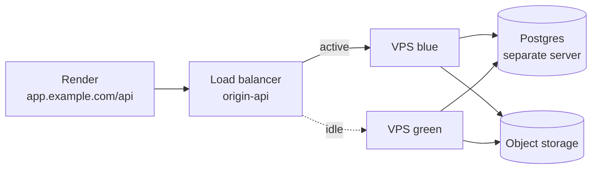

# RFC 0011: Zero-Downtime Backend Deploys

- Status: Proposed
- Date: 2026-10-02
- Owners: Backend

## Summary

Remove deploy downtime with a blue-green swap on the existing VPS: two backend containers, with Caddy switching traffic once `/health/ready` passes. This needs no new servers, no database move and no blob migration.

Two servers behind a load balancer, provisioned with Terraform, is deferred until blobs live in object storage and Postgres runs on its own server.

## Context

Today a backend release briefly drops requests. `deploy-vps.yml` recreates the single `pe-be-backend` container, and requests fail until it is back up.

- The frontend is a static site on Render at `app.example.com`. It proxies `/api/...` to `origin-api.example.com`.
- The VPS runs `docker-compose.prod.yml`, which has three services: `caddy` (TLS and reverse proxy), `backend`, and `db` (Postgres 17, `max_connections=50`).
- The backend writes files to three local Docker volumes: `workout_photos_data`, `chat_attachments_data` and `exercise_images_data`.
- Scheduled jobs run as host `systemd` timers, outside Docker Compose.

The `ndleyton/terraform` branch adds an `infrastructure/` module. It defines a Hetzner server, a firewall that allows ports 22, 80 and 443, and an SSH key.

## Terraform vs Docker Compose

The two tools work at different layers, so neither replaces the other. Docker Compose runs containers on a machine that already exists. Terraform creates the machine and other cloud resources by calling the provider's API.

| Layer | Examples here | Managed by |
| --- | --- | --- |
| Cloud resources | Server, firewall, SSH key, load balancer, private network, bucket, DNS | Terraform |
| Host / OS | Docker install, systemd timers, `.env.production`, backups | Manual today (could be cloud-init or a bootstrap script) |
| Containers | caddy, backend, db, volumes | Docker Compose |
| App code | Image build, migrations, restart | `deploy-vps.yml` |
| Frontend | Static site on Render | Render git integration |

With one VPS that rarely changes, Terraform covers only three resources. The host layer, which is hardest to rebuild today, stays unmanaged either way.

## Options

Both options remove restart downtime. Only option B keeps the app up if the server itself fails, and it costs far more.

**A. Blue-green on one VPS.** Run `backend-blue` and `backend-green` on the existing host, sharing the same volumes and the same Postgres. Caddy, which is already in front of the backend, points `reverse_proxy` at whichever color is active.

**B. Two servers behind a load balancer.** Terraform provisions two backend VPSes, a Hetzner load balancer health-checking `/health/ready`, a private network, a database server, firewall rules and `origin-api` DNS. The deploy pipeline switches the load balancer's target through the hcloud API. Switching through `terraform apply` would tie every release to the Terraform state file and its locking.

| | A: one VPS + Caddy | B: two VPS + LB + Terraform |
| --- | --- | --- |
| No restart downtime on deploys | Yes | Yes |
| Survives losing the server | No | Yes |
| Blob storage change | None | Move to object storage |
| Database change | None | Separate server or managed Postgres |
| New infrastructure | None | LB, second VPS, DB server, network |
| Work involved | Deploy script + Caddyfile + compose | A large project |
| Terraform needed | No | Yes |

## What keeps the app on one server

Option B requires stateless app servers. Today two kinds of state live on the VPS disk.

| State | Where it lives now | What option B needs |
| --- | --- | --- |
| Workout photos | `workout_photos_data` volume | Object storage (Hetzner Object Storage, R2 or S3) |
| Chat attachments | `chat_attachments_data` volume | Object storage |
| Exercise images | `exercise_images_data` volume | Object storage |
| Relational data | `postgres_data` volume, same host | Separate DB server or managed Postgres |

If the files stay local, a photo uploaded to blue exists only on blue, and green returns 404 for it after the switch. Moving to object storage means:

- switching the file writes to an S3 client
- serving files through presigned URLs or a public bucket
- a one-time job that copies the existing files to the bucket

The migrations must also work with old and new code at once, which AGENTS.md already asks for.

Option A avoids all of this: both containers mount the same volumes and talk to the same Postgres.

## Capacity impact (option A)

In normal running, nothing changes, because the deploy stops the old color once traffic has moved. The cost is a short overlap during each deploy, about 30–90 seconds while the new container starts and passes its health check.

| Resource | Steady state | During the overlap |
| --- | --- | --- |
| RAM | Unchanged | +1 backend container (typically about 200–400 MB). Fits on a cx22 (4 GB) beside Postgres's 128 MB of `shared_buffers`. |
| CPU | Unchanged | The new container's startup competes briefly with live traffic. |
| DB connections | Unchanged | Two connection pools are open at once. `2 × (DATABASE_POOL_SIZE + DATABASE_MAX_OVERFLOW)` must stay under about 45, given `max_connections=50`. |
| Disk | +1 image (a few hundred MB) | Same. Clean up old images with `docker image prune`. |

Keeping both colors running all the time for instant rollback would cost one extra backend's worth of RAM permanently. It isn't needed: rolling back means starting the previous image again, which takes seconds.

## Proposal

Adopt option A now.

1. In `docker-compose.prod.yml`, replace the `backend` service (with its fixed `container_name: pe-be-backend`) with `backend-blue` and `backend-green` services that share the same volumes and env file.
2. Make the Caddy upstream switchable. For example, `reverse_proxy {$ACTIVE_BACKEND}:8000`, set from a file the deploy rewrites, followed by `caddy reload`.
3. Update `deploy-vps.yml`:
    1. Find the active color, then build and start the idle one.
    2. Run migrations, which must be backwards-compatible.
    3. Wait until the idle container passes `/health/ready`.
    4. Point Caddy at it and reload.
    5. Verify `/health/ready` through origin HTTPS and `/api/v1/health/ready` through the frontend proxy.
    6. Stop the old color.
4. Before rollout, check the connection pool settings in `.env.production` against the budget above.
5. Make sure systemd jobs that call `docker compose run` target a service name that still exists after the split.

For the `infrastructure/` branch: if it is kept, import the existing server (`terraform import hcloud_server.web_server <id>`) rather than creating a new one, and add `lifecycle { prevent_destroy = true }`. Changing `image` or `location` forces a replacement, which would wipe the local volumes.

## Risks and open questions

- **Migrations:** A migration that breaks the old code will break the old color during the overlap. Schema changes must stay additive, as AGENTS.md requires.
- **Caddy reload:** Reloading Caddy must not drop connections that are in flight. Verify this on staging or during a maintenance window.
- **Scheduled jobs:** Systemd timers currently reference the `backend` service name and need to be audited.
- **Server failure:** Option A does not protect against losing the server. Backups of the Postgres data and the file volumes remain the recovery path.
- **Terraform state:** If Terraform is kept, its state is local and gitignored. Losing it loses track of the server, so consider a remote backend.

## Future work

- Move file storage to object storage. This is worthwhile on its own for backups and server moves, and it is the first prerequisite for option B.
- Move Postgres to a dedicated server or a managed service.
- Codify host setup (Docker, systemd units, env files) in cloud-init `user_data` or a bootstrap script.
- Revisit option B with Terraform once the steps above are done, or when staging or a second server is needed.
